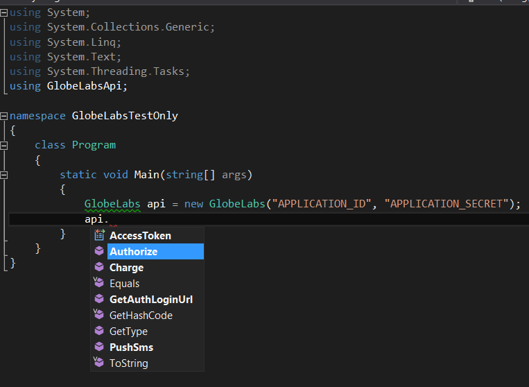

GlobeLabs API for .NET
===========

GlobeLabs API written for the .NET platform. This library provides an easy to use method calls that can be integrated to your existing .NET based application.

## Requirement

In order for you to compile this solution, you must be running in **.NET 4.5** version and compiling in either VS 2012 or VS 2013.

## Installation

If you don't like to compile the source, you just simply download the DLL version in `/Binary` folder and start referencing it to your new or existing projects created in Windows Forms, ASP.NET and Console applications.

Through Nuget Package
On your existing project, install this library with this command in **Package Manager Console**

    Install-Package GlobeLabsApi

For more information about this package, visit [Nuget Package Site](https://www.nuget.org/packages/GlobeLabsApi/)

## Basic Usage

This library internally employs object based parameters to be passed on different GlobeLabs API service using a payload as an object to each type of services. And also, the return data for these services is also greatly simplified.

Developers only needs to instantiate a single class `GlobeLabs` and all API Services are hidden away inside this class employing a singleton pattern.

1. To Authorize and Fetch Access Token:
	```csharp
	using GlobeLabsApi;
	
    // Fetch ApplicationId and ApplicationSecret in your config file
    string applicationId        = "YOUR_APP_ID";
    string applicationSecret    = "YOUR_APP_SECRET";

    GlobeLabs api = new GlobeLabs(applicationId, applicationSecret);

    string code = "CODE_PUSHED_BY_GLOBE_SYSTEM";

    // 1. Retrieve AccessToken based on Code.
    var result = api.Authorize(code); // AuthResponse object

    // Save the result to database, subscriber and access_token pair

    // Uncomment to get return values
    //string accessToken = result.Result.AccessToken;
    //string mobile = result.Result.SubscriberNumber;

    // 2. Generate Url to paste on your web browser
    //var dialogUrl = api.GetAuthLoginUrl();

	```
2. To Send an SMS message to recipient/s:

	```csharp
	using GlobeLabsApi;

    // Fetch accessToken and subscriber number to database after it has passed on the
	// Auth Service.
    string accessToken = "SUBS_ACCESS_TOKEN";

    GlobeLabs api = new GlobeLabs(accessToken);

    var numbers = new List<string>();
    numbers.Add("9171234567");

    // and add more numbers ...
    //numbers.Add("917XXXXXXX");

    var payload = new SmsPayload
    {
        Message = "Testing multiple recipients. Sms Service for Globe.",
        Numbers = numbers
    };

    var data = api.PushSms("SHORT_CODE - ex: 21589999", payload); // SmsResult object

	var result = data.Result; // SmsResponse object
	var status = data.Status; // Standard Web Response Status with Code and Description

	```
3. To Receive an SMS Incoming data from a Raw JSON content:

	```csharp
	using GlobeLabsApi;

    // Fetch accessToken and subscriber number to database after it has passed on the
	// Auth Service.
    string accessToken = "SUBS_ACCESS_TOKEN";

    GlobeLabs api = new GlobeLabs(accessToken);

    const string json = "{\"inboundSMSMessageList\":{\"inboundSMSMessage\":[{\"dateTime\":\"Fri Nov 22 2013 12:12:13 GMT+0000 (UTC)\",\"destinationAddress\":\"21581234\",\"messageId\":null,\"message\":\"Hello\",\"resourceURL\":null,\"senderAddress\":\"9171234567\"}],\"numberOfMessagesInThisBatch\":1,\"resourceURL\":null,\"totalNumberOfPendingMessages\":null}}";

	// From your NotifyURL, Globelabs will send a raw JSON data as POST body
    var data = api.GetIncomingMessage(json);

	// L() is a shortcut method for Console.WriteLine()
    L("Received SMS Messages: " + data.SmsMessageList.Message.InboundSMSMessage.Count());
    L("\tId: " + data.SmsMessageList.Message.InboundSMSMessage[0].MessageId);
    L("\tMessage: " + data.SmsMessageList.Message.InboundSMSMessage[0].Message);
    L("\tFrom: " + data.SmsMessageList.Message.InboundSMSMessage[0].SenderAddress);
    L("\tDate: " + data.SmsMessageList.Message.InboundSMSMessage[0].DateTime);

	```
4. To Charge a Subscriber with a specified amount:
	```csharp
	using GlobeLabsApi;

    GlobeLabs api = new GlobeLabs(accessToken);

    var payload = new PaymentPayload
    {
        Amount = "0.00",
        Description = "Charging API",
        Number = "9171234567",
        /*
         * TIPS for Reference Code:
         * - Fetch the latest count for payment reference in your database
         * - Store it in a variable or update your table that holds the last reference count
         * - IMPORTANT: Make sure that your reference code is unique. Bad Request will occur if code is repeating
         */

        // If your short code is 21554575, then your reference code prefix is 4575 + 7digit numbers        
        ReferenceCode = "45750000001"
    };

    var data = api.Charge(payload); // PaymentResult object
	var result = data.Result; // PaymentResponse object
	var status = data.Status; // Standard Web Response Status with Code and Description
	```

**NOTE:** 
These sample codes are also found in `GlobeLabsApi.LibraryDemo.Console` project folder. You can run and test the demo application showcasing all functionalities of this library.

## Screenshot

-><-

## LICENSE

Licensed under MIT. Code developed by [Earljon Hidalgo](http://twitter.com/earljon) for [Globe Labs API](http://www.globelabs.com.ph) (Beta)
